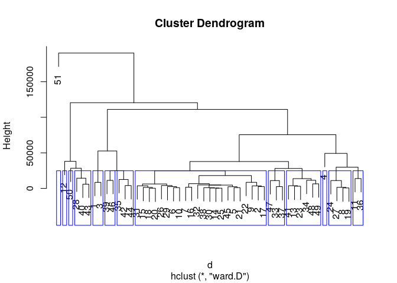
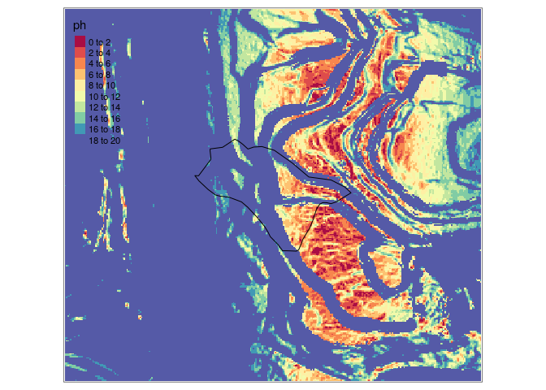

<!-- README.md is generated from README.Rmd. Please edit that file -->

# geoDalle

<!-- badges: start -->

<!-- badges: end -->

Estimation des réserves profondes en milieu karstique

## Installation

``` r
# install.packages("devtools")
devtools::install_github("ONF-AURA/geoDalle")
```

## Principes

### Objet

En milieu karstique, la possibilité d’accéder a des réserves profondes
est fondamentales pour la survie de certaines essences comme le sapin et
le cèdre. Cette possibilité dépend de la présence d’une dalle compacte
non fissurée. Dans ce cas de figure, le pendage de la strate géologique
est souvent conforme (parallèle au sol) et la pente du terrain
régulière. Partant de ces caractéristiques, l’objet est de prédire le
risque de présence d’une telle contrainte.

### Données en entrée

  - Modèle Numérique de Terrain à résolution de 5m ou moins  
  - Polygone sf de la parcelle étudiée  
  - Polygones des strates géologiques meubles (moraines, molasses,
    éboulis…) issus de la carte géologique vectorisée du BRGM  
  - Points d’observation des pendages issus de la carte géologique
    vectorisée du BRGM

### Résulats

``` r
dir <- system.file(package = "geoDalle")
mnt <- raster::raster(file.path(dir, "data","mnt0.tif"))
zn_prf <- sf::read_sf(file.path(dir,"data","zn_prf.shp"))
geo_meuble <- sf::read_sf(file.path(dir,"data","geo_meuble.shp"))
p.pendage <- sf::read_sf(file.path(dir,"data","p.pendage.shp"))
res <- geo_dalle(mnt0=mnt, zn_prf=zn_prf, geo_meuble=geo_meuble, p.pendage=p.pendage)
#> Loading required namespace: igraph
#> Joining, by = "clump"
#> Warning in rgl.init(initValue, onlyNULL): RGL: unable to open X11 display
#> Warning: 'rgl_init' failed, running with rgl.useNULL = TRUE
```



Carte des prédictions du potentiel de réserves profonde



## Fonctionnement détaillé

Voir la vignette du package:

``` r
library(geoDalle)
vignette("geoDalle")
#> starting httpd help server ... done
```
